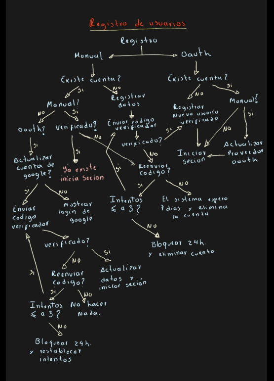
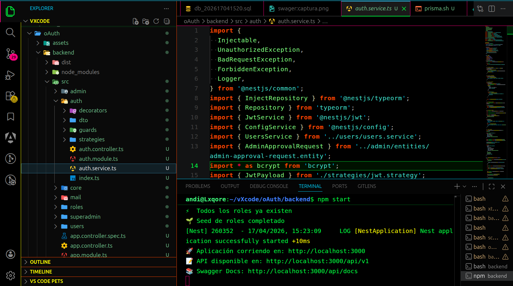
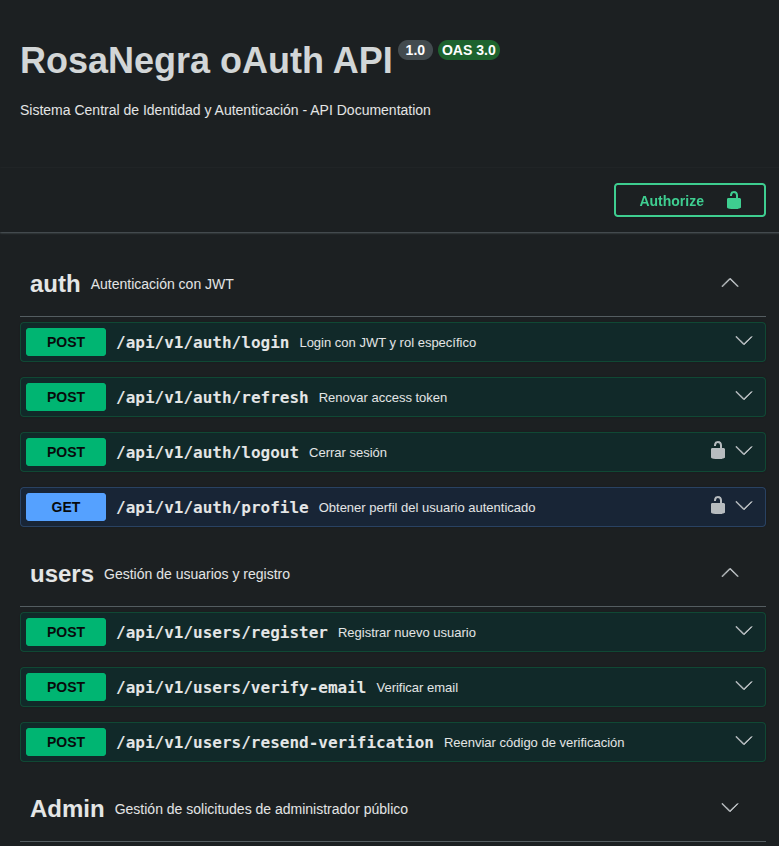

<div align="center">



<br/>

# 🌐 RosaNegra OAuth API

### *Proveedor Centralizado de Identidad (IAM) y Autenticación basada en Roles*

<br/>

<p>
  
  
  
  
</p>

</div>

<br />

## 📋 Descripción General

El proyecto **RosaNegra oAuth API** es un sistema backend centralizado de identidad y autenticación diseñado para gestionar usuarios, perfiles multinivel y permisos en arquitecturas distribuidas (tanto para clientes finales como personal corporativo). 

Ha sido construido bajo **Clean Architecture** utilizando **NestJS**, con un esquema altamente relacional en **MySQL (TypeORM)**, garantizando flujos inquebrantables con doble guardia de seguridad (Access & Refresh Tokens).

> 💡 **Nota de Desarrollo:** Este entorno permite la administración rigurosa de control de accesos basados en roles dinámicos (RBAC Multirol), separando contablemente y de forma auditable la transaccionalidad operativa del negocio.

---

## 📑 Índice

- [Descripción General](#-descripción-general)
- [Características Nucleares](#-características-nucleares)
- [📚 Documentación Profunda](#-documentación-profunda-arquitectura)
- [Arquitectura y Estructura](#-arquitectura-y-estructura)
- [Puesta en Marcha (Instalación)](#-puesta-en-marcha)
- [Tecnologías y Herramientas](#️-tecnologías-y-herramientas)

---

## ✨ Características Nucleares

| Característica | Descripción |
| :--- | :--- |
| 🛡️ **Seguridad Dual (JWT)** | Ciclo de vida robusto separando *Access Tokens* (temporales en memoria) y *Refresh Tokens* (aislados en cookies HTTPOnly). |
| 👥 **RBAC Multirol Único** | Un usuario puede asumir contextos operativos secundarios (Modalidades de Login) sin heredar permisos estructurales globalizados. |
| 🛂 **Onboarding Burocrático** | Flujos B2B aislados. Los administradores postulantes son avalados estrictamente mediante *Magic Links* por un Tribunal SuperAdmin. |
| 🧪 **Swagger Vivo** | Consola dinámica interactiva auto-documentada en todos los endpoints expuestos de la API. |
| 📧 **Mailing Integrado** | Motor de notificaciones asíncronas para validación de códigos de 6 dígitos OTP de doble factor. |

---

## 📚 Documentación Profunda (Arquitectura)

> [!IMPORTANT]  
> Este `README` sirve únicamente para arrancar y testear el servidor. Si tú o nuevos miembros del equipo necesitan entender las decisiones de negocio profundas, los esquemas de bases de datos exactos, y conocer los flujos de "Modalidades de Login Interactivos", revisen el manual del proyecto arquitectónico:
>
> 👉 **[LEER DOCUMENTACIÓN MAESTRA DE IDENTIDAD Y ROLES](./docs/documentacion_maestra.md)**

---

## 🏗 Arquitectura y Estructura Módulos

```text
backend/
├── src/
│   ├── core/                      # Infraestructura, Seeders, Mailing y Base de Datos
│   ├── auth/                      # Motor JWT y Guards Globales
│   ├── users/                     # Módulo B2C (Usuarios/Clientes regulares)
│   ├── admin/                     # Onboarding de Prospectos Operativos
│   ├── superadmin/                # Panel de Concesiones y Tribunal Aprobatorio
│   ├── main.ts                    # Punto de bootstrap integral
│   └── app.module.ts              # Orquestador Raíz
├── docs/                          # Librería de manuales Markdown de negocio (Documentación)
├── package.json                   # Dependencias Base
└── tsconfig.json                  # Compilador Estricto
```

---

## 🔐 Flujo de Autenticación con JWT

<p align="center">
  
</p>

1. **Credenciales IN:** El usuario despacha sus datos de sesión o contexto (Ej: `activeRole` solicitado) vía `POST /auth/login`.
2. **Access Token OUT:** Se emite un token rápido de corto tiempo de vida para desbloquear y autorizar las rutas protegidas.
3. **Refresh Transparente:** Al caducar el acceso temporal, el aplicativo se renueva silenciosamente por trasfondo solicitando un nuevo par de ingresos, evitando cerrar la sesión de golpe.

---

## 🚀 Puesta en Marcha

### Requisitos Previos
- Node.js >= 18.x
- Gestor de paquetes nativo recomendado: `pnpm` (`npm install -g pnpm`)
- Motor Local o Remoto de base de datos **MySQL**

### 1. Clonación e Instalación
```bash
git clone <URL del repositorio>
cd backend
pnpm install
```

### 2. Variables de Entorno
Copia el archivo base y vincula tus credenciales, puertos y correos emisores a tu base de datos y llaves algorítmicas secretas (JWT Secrets):
```bash
cp .env.example .env
```

### 3. Ejecución del Servidor
Levanta la API en modo de vigilancia local para desarrollo en vivo:
```bash
pnpm start:dev
```

### 4. Portal del Desarrollador (Swagger UI)
Si recibes un bloque o necesitas validar un Endpoint, dirígete aquí:
- 👉 **URL Rápida Local:** [http://localhost:3000/api](http://localhost:3000/api)

<p align="center">
  <br>
  
</p>

---

## 🛠️ Tecnologías y Herramientas

| Dependencia | Versión | Tipo en la Arquitectura |
| :--- | :--- | :--- |
| **NestJS** | `^11.0.1` | Framework MVC Centralizado |
| **TypeORM** | `^0.3.28` | Capa SQL Abstraída hacia Clases y Entidades |
| **Passport/JWT** | `^11.0.2` | Emisión, Verificación y Firmas Simétricas HMAC |
| **MySQL** | `^3.22.1` | Persistencia Relacional Transaccional (ACID) |
| **Swagger**| `^11.3.0` | Inspección de REST Controller |

---

<div align="center">
  <p><strong>RosaNegra System</strong> · Construido bajo estándares de <i>Clean Architecture</i></p>
  <p>Licencia: UNLICENSED</p>
</div>
